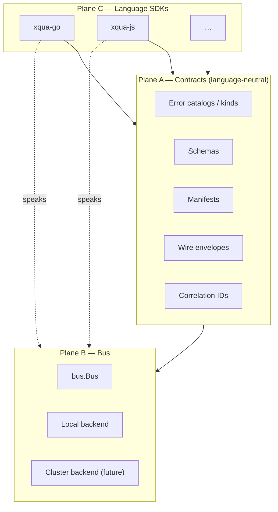
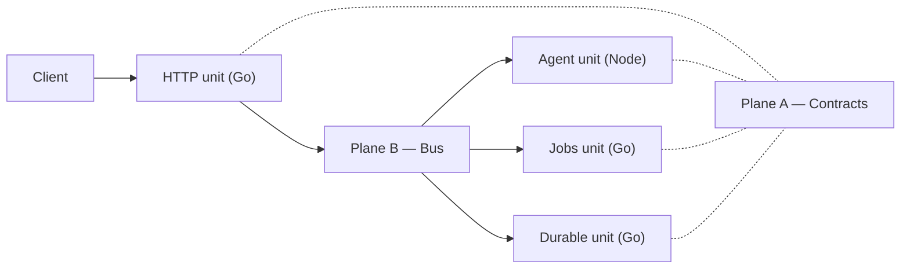
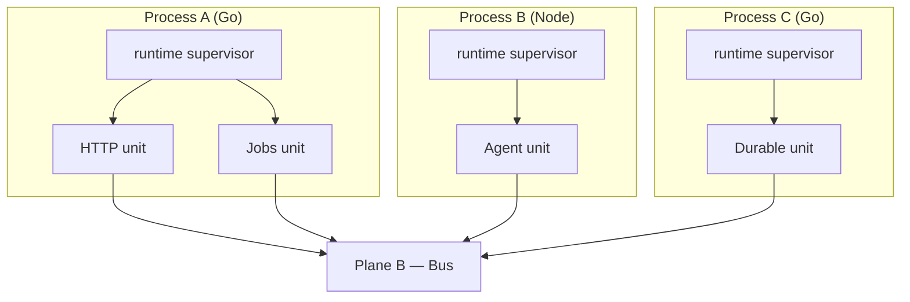

# Architecture draft: layered primitives, runtimes, and polyglot bus

> **DRAFT** — Internal design discussion, not final committed architecture.
> Captured Saturday Jul 4, 2026. Treat as a working note someone can pick up later.

## Context

**xqua-go** is step one: Go implementations of the core primitives. The longer goal is language-agnostic primitives connected through a shared message bus (and later cluster backends behind the same `bus.Bus` interface). A Go service should be able to interface with, for example, a Node.js agent without sharing memory or language packages.

The DX target is lean: do more with less code, conventions with escape hatches. The shape is inspired by the TanStack model—independent layered libraries, plus an opinionated framework that composes them (analogous to TanStack Start around Router). The framework is composition, not concealment: it returns real Layer 0 types and never hides the primitives behind an opaque façade.

## Layer model

```
Layer 2  scaffold / CLI          xqua new → project skeleton + non-Go assets
Layer 1  opinionated kit/framework   composes L0 with defaults; returns real L0 types
Layer 0  headless primitives     errors, logger, ctx, env, http, service, postgres, migrate, …
```

Dependencies point one direction only: L0 never imports L1. Today this is one Go module with subpackages; import direction is enforced by discipline (lint can come later).

The scaffold is intentionally thin. Opinions live in an upgradeable kit package, not in frozen generated code. Generated skeletons should only contain what the kit cannot own.

| Layer | Role | Ownership of opinions |
| --- | --- | --- |
| L0 | Headless primitives | Mechanism only |
| L1 | Opinionated kit / framework | Defaults, wiring, conventions |
| L2 | Scaffold / CLI | Project skeleton and non-Go assets the kit cannot own |

## `pkg/runtime` (was `pkg/service` + `pkg/transport` + `pkg/ctx`)

Done: supervisor, supervisee interface (`Unit`), and application `Ctx` live together in `pkg/runtime`. HTTP is a sibling at `pkg/http` and implements `runtime.Unit`. `pkg/service`, `pkg/transport`, and `pkg/ctx` are deleted.

A few small policies currently live in runtime that arguably belong in L1:

- Panic on `Ctx.Build` failure
- “At least one unit required”

`ownsLogger` / default-logger construction are gone: `runtime.New` requires a non-nil Logger, and the caller owns the logger lifecycle. The lean preference is to strip remaining opinions so runtime remains pure mechanism and opinions live only in the kit.

## Mental model: three planes

Cross-language interoperability rests on three planes:

- **Plane A — Contracts (language-neutral):** error catalogs and kinds, schemas, manifests, wire envelopes, correlation IDs.
- **Plane B — Bus:** inter-unit messaging (`pkg/bus`: publish / subscribe / request-reply). Future cluster backends implement the same `Bus` interface; discovery and identity may grow as related concerns, not a separate “fabric” package.
- **Plane C — Language SDKs (`xqua-go`, `xqua-js`, …):** idiomatic implementations of Plane A that speak Plane B.

**Cross-language rule:** runtimes interoperate **only** through Plane A over Plane B. Never share memory or language packages.

**Naming:** the messaging plane is **bus only** — package `pkg/bus`, interface `bus.Bus`. Do not introduce a parallel `fabric` package or API name.



### Example path: client to polyglot runtimes

A client hits an HTTP unit in Go. That process may fan out over the bus to a Node agent, Go jobs workers, and Go durable runners. Units meet only on contracts over the bus.



## Future primitives

| Primitive | Unit role | Contract surface | Bus usage |
| --- | --- | --- | --- |
| HTTP | Inbound edge | Routes, envelope, public catalog, manifest | Optional outbound to other units |
| Jobs | Worker | Job types, payloads, retry / failure codes | Pull / push work |
| Durable execution | Workflow runner | Workflow defs, step results, saga errors | Timers, state, signals |
| Agents | Sessionful reasoner | Tools, turns, memory refs, agent errors | Tool calls as bus request/reply |

`runtime` is the process supervisor. One process can host multiple units, or units can be deployed in separate processes and meet only on the bus.



## Language-agnostic approach

Contracts are neutral; SDKs are per language. Do not implement primitives in a “neutral” language and generate everything from it. Implement idiomatic SDKs that share wire contracts.

Recommended order:

1. Freeze wire contracts.
2. Implement in Go (this repository).
3. Stand up the bus (local first, then cluster backends behind `bus.Bus`).
4. Add a second language (Node) as the interop acceptance test.

Error identity is Go-local when using pointer identity. On the wire, identity is the public catalog (`kind`, `code`). **Option B is already chosen:** public catalog identity on the wire, not pointer identity.

A shared contracts repository is a natural home for the frozen surface—for example `xqua-spec` or `xqua/contracts`—holding manifest shape, envelope v1, error shape, and correlation headers.

## Lean DX

| Layer | DX posture |
| --- | --- |
| L0 | Explicit; more code; full control |
| L1 kit | `xqua.New` wires service + defaults + standard errors + env + health; returns real L0 types |
| L2 scaffold | Only what the kit cannot own |

The same conceptual shape should appear across SDKs, expressed idiomatically per language.

## Bus (`pkg/bus`)

Plane B is **bus only**: `pkg/bus` is the location-transparent message bus units use instead of Go pointers. No separate fabric package or name.

- **Headless:** runtime does not own or create the bus (same posture as Logger). The caller builds `bus.NewLocal(bus.LocalConfig{})` in `main` or app `Ctx.Build` and unit factories close over / read it from app ctx.
- **Local landed:** `Message`-based `Publish` / `Request` (headers ride along), fan-out `Subscribe`, `QueueSubscribe` competing consumers, and `*`/`>` wildcard subjects. Each subscription is a bounded mailbox drained by one FIFO worker: per-subscription ordering, bounded memory, panic isolation (recovered via `LocalConfig.OnError`), and blocking backpressure.
- **Shutdown:** `Close` stops immediately and abandons queued work; `Drain(ctx)` stops intake, drains queued messages, then closes — units drain the bus on graceful shutdown.
- **Not yet:** cluster backend. The `Bus` interface is the stable surface for that later.

See `pkg/bus` and `examples/bus` (HTTP unit request/replies to a worker unit on `demo.work`).

## Open decisions

1. **Cluster bus timing:** local is in; when to add a networked `Bus` implementation remains open.
2. **How opinionated is L1:** assembly-only vs also conventions such as typed handlers and store patterns.
3. **Runtime policies:** whether to strip small policies into a future kit (panic on `Ctx.Build` failure, at-least-one-unit). Default logger / `ownsLogger` already removed from runtime.

## Current state

A DX batch has already landed in xqua-go:

- Standard kinds and kind → status defaults
- `StandardErrors`
- `ParamInt64`
- `Pair` / mappers
- `/health` and `/version`
- `pkg/env`
- Manifest recording (route summaries, path params, declared errors via `http.Route` fields with resolved statuses, full catalog, envelope version)
- OpenAPI 3.2 generation in `pkg/http` (`http.Generate(manifest, spec)`; pure data in → spec out). `Config.OpenAPI []http.OpenAPISpec` auto-registers a lazy `GET` endpoint per document — several surfaces on one transport, filtered by path prefix and route membership tags (`Route.Specs`), each with a catalog subset. Huma-inspired but keeps catalog errors and RES handlers. Body schemas are declared explicitly (`Route.RequestBody` / `Route.Response`, inline or `Ref`), with an optional `http.SchemaOf[T]()` reflect helper.
- `pkg/bus` local bus (Message-based Publish / Request, Subscribe / QueueSubscribe, wildcards, bounded FIFO mailboxes, Drain)

The manifest is the seed of Plane A: a language-local recording surface that can later feed shared contracts and codegen.

---

**DRAFT** — Not final architecture. Discussion note dated Saturday Jul 4, 2026.
